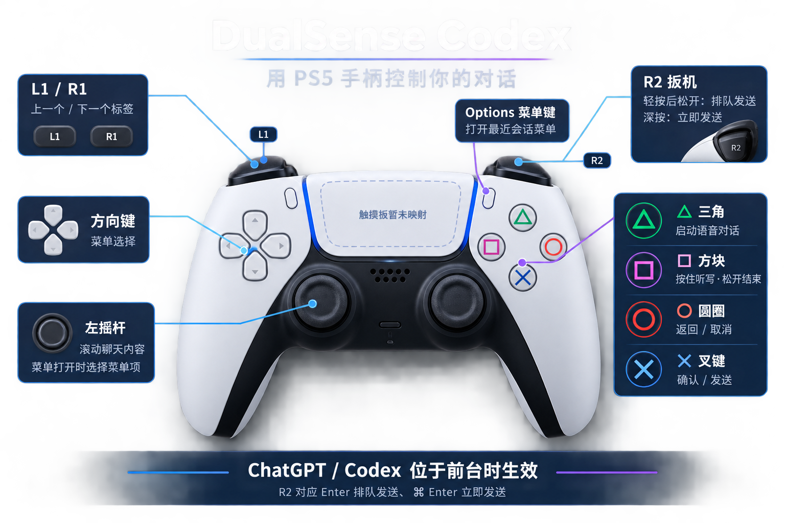

# DualSense Codex

Use a PS5 DualSense controller for dictation, chat navigation, message submission,
conversation scrolling and optional turn-end haptics in a macOS Codex/ChatGPT desktop app.

[简体中文](README.md) · [MIT License](LICENSE) · [Contributing](CONTRIBUTING.md)



A community-built Swift menu bar utility using AppKit, GameController and Core Haptics.
No third-party runtime dependencies, API keys or accounts. Not affiliated with Sony or OpenAI.

## Requirements and installation

- macOS 12+, Xcode Command Line Tools or Xcode with a macOS SDK.
- DualSense connected over Bluetooth or a USB data cable. Standard DualSense has
  been used on Apple Silicon; Edge and Intel builds have not been hardware-tested.
- The foreground app must have bundle ID **`com.openai.codex`**. The development
  machine's app is named ChatGPT, but this does not imply support for every ChatGPT
  desktop app or a browser tab. App updates and custom shortcuts may affect mappings.

```sh
xcode-select --install # Skip if the development tools are already installed.
bash build.sh "$HOME/Applications/DualSense Codex.app"
open "$HOME/Applications/DualSense Codex.app"
```

Grant Accessibility access to that exact app in System Settings → Privacy & Security.
Some macOS versions label this page “Device Control and Data Access.”
The 🎮 menu displays connection, permission and input status.

Builds are ad hoc signed, not Developer ID signed or notarized. Rebuilding may invalidate
existing Accessibility authorization even if its switch still appears enabled. Remove
and re-add the current app if needed. Build into Applications to avoid sync-folder metadata
that can interfere with code signing.

## Controls

| Input | Action |
| --- | --- |
| Square | Hold Control+Shift+D for dictation; release to finish |
| Triangle | Control+Shift+V to start voice |
| Cross | Return: choose, send or confirm the current UI |
| Circle | Escape: cancel/back or the app's current Escape action |
| Options | Command+Shift+P: command menu including recent chats |
| D-pad | Arrow keys |
| Left stick | Scroll chat content; navigate the Options menu |
| L1 / R1 | Command+Shift+`[` / `]`: previous/next tab, depending on focus |
| R2 light press, then release | Enter: queue a message |
| R2 deep press | Command+Enter: steer a running turn |

Cross and Circle can also act on approval/confirmation dialogs. Use them with awareness
of the current UI. Pause mapping through the 🎮 menu.

R2 assumes **Enter sends and follow-ups queue by default** in the target app. The shortcut
meanings can change with composer settings. Focus the input and finish dictation first.
The trigger engages at 18%, releases below 8%, and fires immediately at 82%; releasing
after a deep press does not send twice. This measures travel, not physical impact.

Scrolling follows the real composer element's geometry rather than a fixed outer-window
coordinate. Click the conversation input once if discovery fails. Multi-editor or unusual
layouts may still need adjustment: this is a geometry heuristic, not an official scrolling
API. Stick dead zone is 22%, with speed increasing with deflection.

The app does not record or mute audio. Recording belongs to the target app; use a Mac or
headset microphone rather than relying on the controller microphone on macOS. Touchpad
clicks and gestures are currently unmapped. The separate microphone companion has been removed.

## Optional haptics

Use 🎮 → the two-pulse test to try the connected controller. For turn-end notifications:

```sh
python3 install-hooks.py
```

This merges one Stop hook into `$CODEX_HOME/hooks.json` (default `~/.codex/hooks.json`),
preserving other hooks and backing up an existing file before its first modification.
It does not overwrite `notify`. Review/trust the hook in a compatible Codex client
(`/hooks` in the CLI); a session reload may be required. The sample assumes installation
under `~/Applications`.

The helper validates Stop input and sends a local notification containing opaque session
and turn IDs. It ignores response text. The menu app deduplicates notifications and limits
haptic frequency. Stop means a reply turn ended, not that a project passed acceptance;
other hooks may continue work. End-to-end automatic notifications depend on client support
and hook trust and have not been verified across all versions.

## Development

```sh
bash test.sh
bash build.sh
```

Tests cover held-key lifecycle, R2 state transitions, menu routing, scroll geometry,
notification validation and hook merging/idempotence without sending UI events.
Hardware behavior is validated separately. For a 15-second input-only diagnostic, quit the
menu app first and run its executable with `--diagnose`.

The app makes no network requests, has no telemetry and saves no chat content. Accessibility
access reads UI roles/geometry and posts keyboard/scroll events. The target app retains its
own recording, transcription and message handling policies. Local haptic notifications are
not authenticated; another local process can trigger a vibration, but cannot execute a
command through this notification handler.

To uninstall, quit and remove the app and its Accessibility entry. If installed, remove
only the `DualSenseNotify` hook from hooks.json. No login item or background service is installed.
